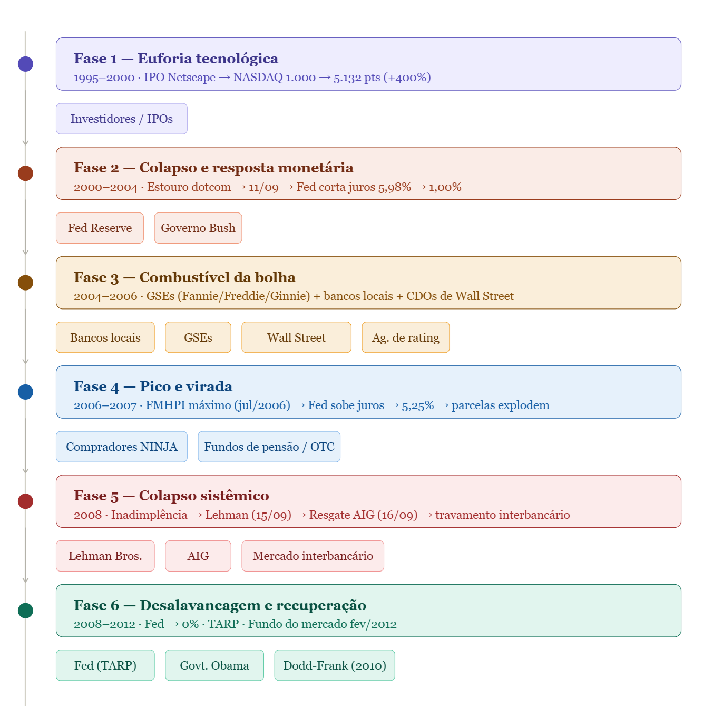

```{r}
source("posts/bubble_cronology/preamble.R")
load("posts/bubble_cronology/consolidated_data.rda")
```

## Introdução

Apesar de já terem se passado quase duas décadas, a crise (ou bolha) conhecida como Crise do Imobiliária Subprime permanece como um importante fenômeno econômico e até mesmo comportamental, que merece ser investigado e compreendido. O período que pretendemos descrever se refere ao crescimento explosivo dos preços imobiliários nos EUA (ao menos em muitas regiões do país), à chegada ao seu valor máximo, até então nunca visto, e ao subsequente colapso desses mesmos preços, e sendo assim, algo iniciado no mercado financeiro e imobiliário e que culminou afetando a vida de milhões de pessoas ao redor do globo.

Muitos dos instrumentos financeiros, mecanismos de propagação, entre outros fatores, permanecem sendo usados (embora não no mesmo contexto) até os dias atuais. Este fatídico período da história econômica nos rende, ademais, uma série de analogias de que podemos fazer uso atualmente para compreender fenômenos econômicos e práticas financeiras que ainda são observadas. Além disso, compreender o período, nos brinda com informações que nos auxiliam a diferenciar uma verdadeira bolha especulativa de movimentos 'naturais' dos mercados financeiros.

A ideia deste curto texto é, despretensiosamente, demonstrar da maneira mais didática possível o que ocorreu naquele período: desde os fenômenos precursores da bolha, quando talvez ela tenha de fato começado, quais foram os combustíveis adicionados e a eclosão, até o retorno a uma ideia de normalidade.

De antemmão, vejamos os principais eventos que se supõe terem afetado o curso dos preços imobiliários nos EUA:

::::::::::{.column-page}

```{r}
#| label: tbl-eventos
#| tbl-cap: "Cronologia de Eventos Críticos do Mercado Imobiliário (1995–2012)"

tabela_eventos <- eventos_usa %>%
  select(Data, label, implicacao) %>%
  rename(
    "Data" = Data,
    "Evento" = label,
    "Implicação" = implicacao
  ) |> 
filter(is.na(`Implicação`) == FALSE)

tabela_eventos %>%
  kbl(booktabs = TRUE, align = c("l", "l", "l")) %>%
  kable_styling(
    bootstrap_options = c("striped", "hover", "condensed"),
    full_width = TRUE,
    font_size = 14
  ) %>%
  column_spec(1, bold = TRUE, width = "10em") %>%
  column_spec(2, width = "16em") %>%
  column_spec(3, width = "30em")
```

::::::::::

<br>

Abaixo podemos observar um gráfico que mostra a evolução mensal dos preços imobiliários nos EUA, medidos pelo índice Freddie Mac House Price Index (**FMHPI**), desde 1990 até Junho 2025. No eixo y-esquerdo está a evolução do FMHPI (em azul) bem como a evolução do índice de aluguéis Rent of Primary Residence in U.S. City Average (RPR) (em vermelho), ambos não ajustados para sazonalidade ou inflação e com base 100 em Janeiro de 1990. No eixo y-direito, pode-se ver uma importante medida denominada Price-to-Rent Ratio (em preto), que nada mais é que a diferença do logaritmo dos índices de preços e dos aluguéis.

O gráfico também demarca os principais eventos listados na tabela acima, para que seja possível observar a relação entre os eventos e a evolução das séries.

<br>

```{r}
#| column: page
#| fig-height: 6

scale_factor <- 10 

p <- plot_ly(MDF_usa, x = ~date) |>
  
  # Fed Funds como barras
  add_bars(
    y = ~fed_funds * scale_factor,
    name = "Fed Funds Rate",
    marker = list(color = "lightgrey", opacity = 1),
    width = 20 * 24 * 60 * 60 * 1000,
    customdata = ~fed_funds,
    hovertemplate = "Fed Funds Rate: %{customdata:.2f}%<extra></extra>"
  ) |>
  
  # Price Index
  add_lines(
    y = ~fmhpi,
    name = "Price Index",
    line = list(color = "#0C447C", width = 2),
    opacity = 0.75
  ) |>
  
  # Rent Index
  add_lines(
    y = ~rents,
    name = "Rent Index",
    line = list(color = "#5F5E5A", width = 1.5, dash = "dash")
  ) |>
  
  # Fed Funds como linha fina (linha sobreposta às barras)
 add_lines(
    y = ~fed_funds * scale_factor,
    name = "Fed Funds (line)",
    line = list(color = "#2C2C2A", width = 0.5),
    customdata = ~fed_funds,
    hovertemplate = "Fed Funds Rate: %{customdata:.2f}%<extra></extra>",
    showlegend = FALSE
  ) |>
  
  # Linha conectando eventos (eventos_usa)
  # add_lines(
  #   data = eventos_usa,
  #   x = ~date,
  #   y = ~fmhpi_real,
  #   name = "Event Path",
  #   line = list(color = "lightgrey", width = 1.2),
  #   showlegend = FALSE
  # ) |>
  
  # Pontos nos eventos
  add_markers(
    data = eventos_usa,
    x = ~date,
    y = ~fmhpi_real,
    name = "Key Events",
    marker = list(color = "lightgrey", size = 8),
    text = ~paste0("<b>", label, "</b><br>", Data, "<br>", implicacao),
    hoverinfo = "text",
    showlegend = FALSE
  ) |>
  
  # Linhas verticais e anotações nos eventos
  add_segments(
    data = eventos,
    x = ~date, xend = ~date,
    y = 0, yend = max(MDF_usa$fmhpi, na.rm = TRUE) * 1.05,
    line = list(color = "gray40", dash = "dot", width = 1),
    showlegend = FALSE,
    hoverinfo = "none"
  ) |>
  
  # Anotações (labels) nos eventos
  add_annotations(
    data = eventos,
    x = ~date,
    y = max(MDF_usa$fmhpi, na.rm = TRUE),
    text = ~label,
    textangle = -90,
    showarrow = FALSE,
    xanchor = "left",
    yanchor = "bottom",
    font = list(size = 10, color = "gray30")
  ) |>
  
  layout(
    title = list(
      text = "<b>Housing Bubble Detection: Price vs. Rents</b><br><sup>Lightgrey line highlights the slopes between key historical milestones</sup>",
      x = 0
    ),
    xaxis = list(title = "Year"),
    yaxis = list(
      title = "Indices (Base 100)"
    ),
    yaxis2 = list(
      title = "Fed Funds Rate (%)",
      overlaying = "y",
      side = "right",
      showgrid = FALSE,
      tickvals = seq(0, max(MDF_usa$fed_funds, na.rm = TRUE) * scale_factor, by = scale_factor),
      ticktext = paste0(seq(0, max(MDF_usa$fed_funds, na.rm = TRUE), by = 1), "%")
    ),
    legend = list(
      orientation = "h",
      x = 0.5, xanchor = "center",
      y = -0.15
    ),
    hovermode = "x unified",
    plot_bgcolor  = "white",
    paper_bgcolor = "white"
  )

p
```

::: {.callout-note collapse="true"}
## O que é um CDO?
A tecnologia da destruição é criada. O primeiro **CDO** nasce no Drexel Burnham Lambert.

- **O Conceito:** Transformar "lixo" (Junk Bonds) em títulos com selo AAA através de tranches.
- **A Semente:** A engenharia financeira prova que é possível "esconder" o risco em pacotes complexos.

:::

:::: {layout="[0.475, 0.05, 0.475]"}
::: {#firstcol}
This text will automatically flow into the second column once it reaches the bottom of the first column within the defined layout area. You can include paragraphs, lists, and other markdown elements.
:::

::: {#secondcol}
{fig-align="center"}
:::
::::

## O Vácuo das Pontocom e o 11 de Setembro

Em meados da década de 1990, o mundo testemunhava uma série de transformações na área de tecnologia e internet. Havia muita expectativa acerca do potencial transformador da internet e das novas tecnologias que poderiam advir dela, algo parecido com a atual euforia em torno da inteligência artificial. De fato, a internet nos possibilitou, inclusive que você esteja hoje lendo este texto, e isso é algo que, para minha geração, era algo inimaginável. O que aconteceu foi que, com a chegada da internet, houve uma explosão de empresas de tecnologia, muitas das quais eram *startups* sem um modelo de negócios claro. A euforia em torno dessas empresas levou a uma valorização excessiva de suas ações, criando o que ficou conhecido como a **bolha das pontocom**.

O mercado de ações refletiu essa euforia, com o índice NASDAQ, composto principalmente por empresas de tecnologia, atingindo seu pico em março de 2000. A título de exemplo, em agosto de 1995 (IPO da Netscape), o índice estava na marca de 1.000 pontos, e em março de 2000 alcançou 5132 pontos, uma valorização de aproximadamente 400% em apenas cinco anos. O estouro da bolha ocorreu quando os investidores perceberam que muitas dessas empresas não tinham modelos de negócios sustentáveis ou lucros reais, resultando em uma queda acentuada nos preços das ações. Em outubro de 2002, o índice NASDAQ havia caído para cerca de 1100 pontos, representando uma perda de aproximadamente 80% em relação ao pico de março de 2000. É importante ressaltar que, o estouro da bolha das pontocom, embora tenha sido um evento importante, não foi o gatilho direto para a crise do subprime. Outros eventos vão ainda alimentar o ambiente econômico que levaria à bolha imobiliária.

No decorrer do ciclo de queda no índice NASDAQ, mais precisamente em 11 de Setembro de 2001, o mundo sofreu com a catástrofe traumática do atentato às Torres Gêmeas e ao Pentágono, eventos que reforçaram um ambiente econômico caótico e que estimulou dois importantes fenômenos fundamentais para a crise que viria, quais sejam: 

1. afrouxamento monetário;  
2. migração de capital para ativos reais. 

O que acontece é que, com o estouro da bolha das pontocom, o Federal Reserve (Fed) inicia um ciclo de queda agressiva da taxa de juros (Fed Funds Rate), que passa de 5,98% para 1% em um período relativamente curto. O objetivo do Fed era estimular a economia e evitar uma recessão profunda, uma medida que, de fato, foi eficaz para alcançar esse objetivo imediato embora tenha tido consequências de longo prazo. O afrouxamento monetário, ao reduzir o custo do crédito amplia a liquidez no sistema financeiro e estimula o consumo e o investimento, aquecendo a atividade econômica. 

Mas em economia sempre existe um trade-off e o efeito colateral foi criar um ambiente de crédito demasiado barato, incentivando o endividamento e o mais importante pra nós neste texto, estimular também a busca por investimentos mais arriscados. Na visão do investidor, com a queda dos juros, os retornos de investimentos tradicionais, como títulos do governo e depósitos bancários, tornam-se menos atraentes e, por conseguinte, tais investidores começam a buscar alternativas que ofereçam retornos mais elevados, e quais seriam estes? O mercado imobiliário!!!

Resumindo, a partir do fim da bolha das pontocom, após o 11 de Setembro e finalmente, com a política monetária reduzindo as taxas de juros da economia, começamos a observar a primeira aceleração de preços imobiliários crescendo acima do crescimento dos aluguéis, algo que se intensificaria nos anos seguintes e que, como veremos, é um dos principais indicadores de bolhas imobiliárias!!!

```{r}
#| column: page


tabela_dotcom <- eventos |>
  filter(label %in% c("IPO da Netscape", "Pico do NASDAQ", "Fim da Bolha das Pontocom")) |>
  select(date, Data, label) |>
  left_join(
    MDF_usa |>
      select(date, fmhpi_real, fed_funds),
    by = "date"
  ) |> 
  mutate(
    nasdaq     = c(1000, 5132, 1108),  # valores históricos confirmados
    fmhpi_var  = round((fmhpi_real / lag(fmhpi_real) - 1) * 100, 1),
    fed_var    = round(fed_funds - lag(fed_funds), 2),
    nasdaq_var = round((nasdaq / lag(nasdaq) - 1) * 100, 1)
  ) |>
  transmute(
    `Data`       = Data,
    `Evento`     = label,
    `NASDAQ`     = nasdaq,
    `Var. NASDAQ (%)` = nasdaq_var,
    `FMHPI`      = round(fmhpi_real, 2),
    `Var. FMHPI (%)` = fmhpi_var,
    `Fed Funds (%)` = fed_funds,
    `Var. Fed Funds (p.p.)` = fed_var
  )

tabela_dotcom |>
  mutate(across(everything(), ~replace_na(as.character(.), ""))) |>
  kbl(booktabs = TRUE, align = c("l", "l", rep("r", 6)), digits = 1) |>
  kable_styling(
    bootstrap_options = c("striped", "hover", "condensed"),
    full_width = TRUE,
    font_size = 14
  ) |>
  column_spec(1, bold = TRUE, width = "8em") |>
  column_spec(2, width = "16em") |>
  add_header_above(c(" " = 2, "NASDAQ" = 2, "FMHPI" = 2, "Fed Funds" = 2))
```

::: {.callout-tip}
## Nota minha

A bolha pontocom foi predominantemente um fenômeno de mercado, impulsionado por expectativas privadas desancoradas da realidade. Já a bolha imobiliária foi amplificada por falhas institucionais deliberadas, política monetária agressiva, regulação e incentivos públicos que distorceram sistematicamente a precificação do risco.
:::

<br>

## A Política Habitacional, as GSEs e Wall Street

Neste ponto, três novos players entram em cena: os bancos locais, as GSEs e os bancos de investimento de Wall Street. Primeiro, um contexto! Em meados da década de 90, uma mudança estrutural na política habitacional americana começou a remodelar o mercado imobiliário. As **Government-Sponsored Enterprises (GSEs)** são empresas privadas, mas com patrocínio federal que foram criadas para ampliar o acesso ao crédito hipotecário e duas delas são fundamentais nessa história: **Fannie Mae** e **Freddie Mac**. Além das GSEs, outra importante instituição é a **Ginnie Mae**, uma agência pública vinculada ao Ministério da Habitação e Desenvolvimento Urbano dos EUA. 

Ok, mas como elas entram na história? O que aconteceu foi que, a partir da década de 90, o governo americano começou a adotar uma série de políticas habitacionais que tinham como objetivo expandir o acesso à moradia, especialmente para famílias de baixa renda. O marco regulatório decisivo foi o Housing and Community Development Act de 1992, que impôs às GSEs metas obrigatórias de aquisição de hipotecas voltadas para estas famílias de baixa renda, e mais, nos governos seguintes, essas metas foram sendo progressivamente elevadas, até que em 2004, o governo Bush levou ao limite, abrindo caminho para a expansão desenfreada do crédito subprime (explico mais à frente o porque do termo subprime).

Essas instituições fazem o seguinte: compram hipotecas dos bancos locais (vamos falar um pouco sobre a estrutura bancária nos EUA daqui a pouco), securitizam-nas num instrumento chamado **Mortgage-Backed Securities (MBS)** e as revendem a investidores como você, eu, fundos de pensão e afins. Isso tem seu valor, pois mantém a liquidez do mercado hipotecário. Mas em economia, tudo tem uma contrapartida, e o problema é que metas cada vez mais agressivas criaram um incentivo complicado: os bancos locais pararam de se preocupar com a qualidade do crédito que concediam, pois sabiam que conseguiriam repassar o risco para as GSEs, que por sua vez sempre tinham o governo como garantidor [@keys2010]. O resultado foi uma avalanche de empréstimos a tomadores com histórico de crédito precário, os tais **Subprime**, cujo risco, uma vez pulverizado em títulos financeiros, tornava-se progressivamente invisível para quem o carregava.

Aqui está a fórmula para o desastre. Os bancos locais, que em condições normais só concederiam crédito após uma análise séria do tomador, passaram a ter um incentivo perverso para relaxar seus padrões de concessão. Famílias inteiras sem renda, sem emprego e sem ativos (**no income + no job + no assets = NINJA**) passaram a ser financiadas e ter acesso a hipotecas com as quais antes não conseguiriam arcar, muitas vezes em condições contratuais no mínimo duvidosas. O resultado foi uma explosão de empréstimos de baixa qualidade, isto é, de alto risco e alta propensão à inadimplência, mas que, graças à securitização, chegavam ao investidor final com aparência de ativos seguros. Temos aqui um exemplo clássico de **Risco Moral (Moral Hazard)**: ao não arcarem com as consequências de suas próprias decisões de crédito, os bancos passaram a assumir riscos que jamais assumiriam com o próprio dinheiro em jogo, alimentando progressivamente a instabilidade de todo o sistema financeiro.

::: {.column-margin}
We know from *the first fundamental theorem of calculus* that for $x$ in $[a, b]$:

$$\frac{d}{dx}\left( \int_{a}^{x} f(u)\,du\right)=f(x).$$
:::

Agora, você deve estar se perguntando onde entra Wall Street nessa história, e, como tais hipotecas de baixa qualidade, concedidas por bancos locais, acabaram sendo vendidas para investidores globais como se fossem títulos seguros. Como o calote num pagamento de uma hipoteca concedida na Califórnia poderia afetar um fundo de pensão na Noruega? Ou um investidor individual aqui no Brasil?
 
Na próxima seção vamos incluir nessa história três outros personagens fundamentais: os bancos de investimento, as agências de rating e o mercado de balcão (OTC). 

## Alquimia financeira e um AAA duvidoso

Você já deve ter percebido que emprestar dinheiro para pessoas sem renda, sem emprego e sem ativos é algo que, em condições normais, não é muito prudente. Relembre que as GSEs, acabaram por estimular esse comportamento, e acabaram por conferir uma credibilidade ao mercado de hipotecas de baixa qualidade, pois, como o governo era o garantidor final, os investidores acreditavam que estavam comprando títulos seguros. Além disso, eram instituções gigantescas, com um histórico de estabilidade e, portanto, a percepção de risco era muito baixa. E aí entra um outro player fundamental! 

O que aconteceu foi que, com o tempo, os bancos de investimento de Wall Street começaram a perceber que poderiam lucrar muito mais se comprassem essas hipotecas de baixa qualidade dos bancos locais, as securitizassem em instrumentos financeiros complexos e as vendessem para investidores globais como se fossem títulos seguros. A alquimia era a seguinte: esses bancos de investimento pegavam as hipotecas de baixa qualidade, as fatiavam e as misturavam com outras de qualidade superior, ou seja, diversificavam, e finalmente empacotavam essas hipotecas de risco diversos em instrumentos chamados **Collateralized Debt Obligations (CDOs)**, que eram vendidos a investidores como se fossem títulos de alta qualidade. O problema é que, como não havia um mercado organizado para esses títulos (eles eram negociados no chamado Mercado de Balcão ou OTC), os preços eram baseados em modelos financeiros complexos, e não na realidade do risco subjacente.

Como o lixo foi vendido como ouro.

- **Securitização:** Hipotecas podres são fatiadas e misturadas em CDOs.
- **O Ponto Cego:** Como não havia bolsa (Mercado de Balcão/OTC), os preços eram baseados em modelos, não na realidade.
- **Agências de Rating:** O carimbo "AAA" deu aos fundos de pensão a permissão legal para comprar risco sistêmico.

## Capítulo 5: O Margin Call Global (2007–2008)

O castelo de cartas começa a balançar com a subida dos juros.

- **O Gatilho:** O Fed sobe juros para 5,25% $\rightarrow$ As parcelas do "Daniel" dobram $\rightarrow$ A inadimplência explode.
- **15/09/2008:** Lehman Brothers declara falência. O mercado interbancário trava (ninguém confia em ninguém).
- **16/09/2008:** O resgate da **AIG** prova que o sistema estava segurado por uma empresa que não tinha dinheiro para cobrir o sinistro.

## Referências

::: {#refs}
:::